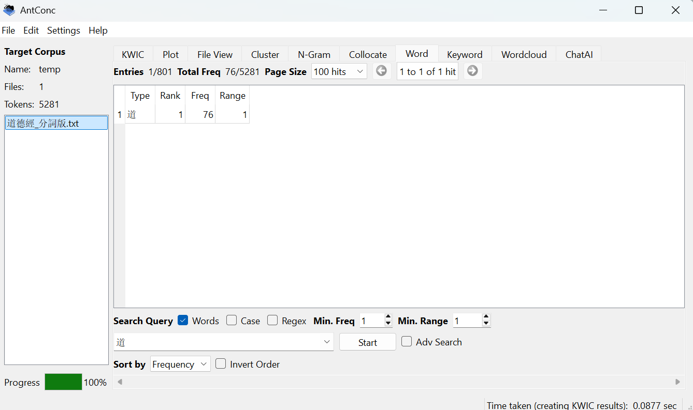
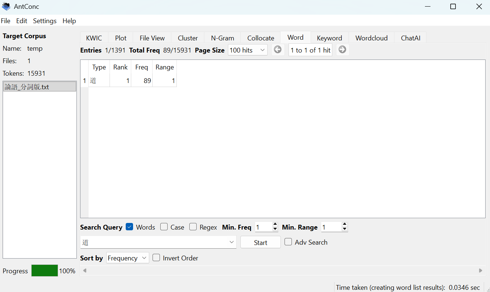
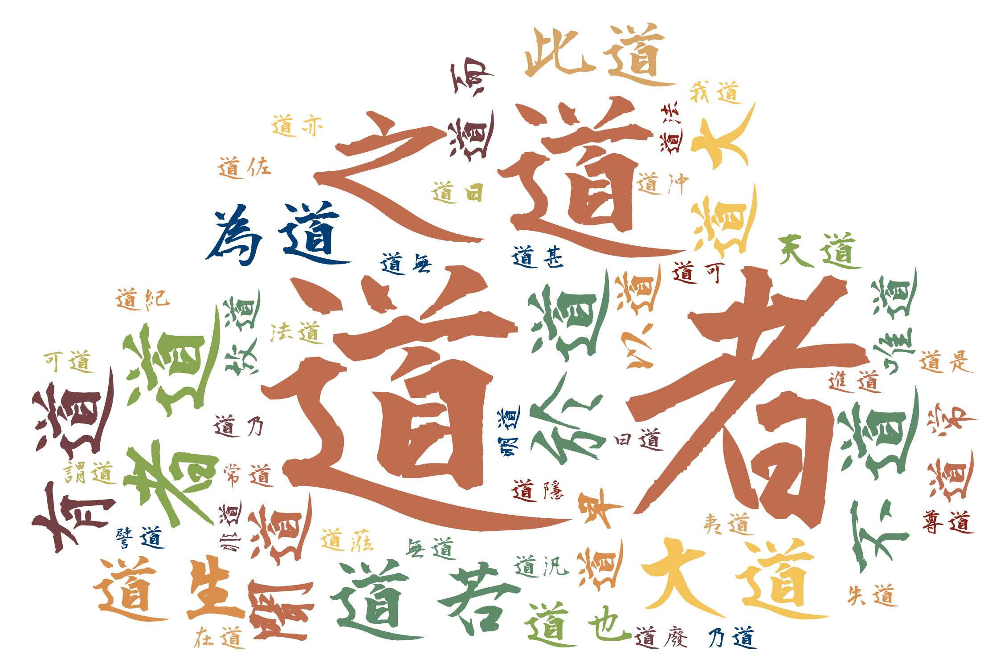
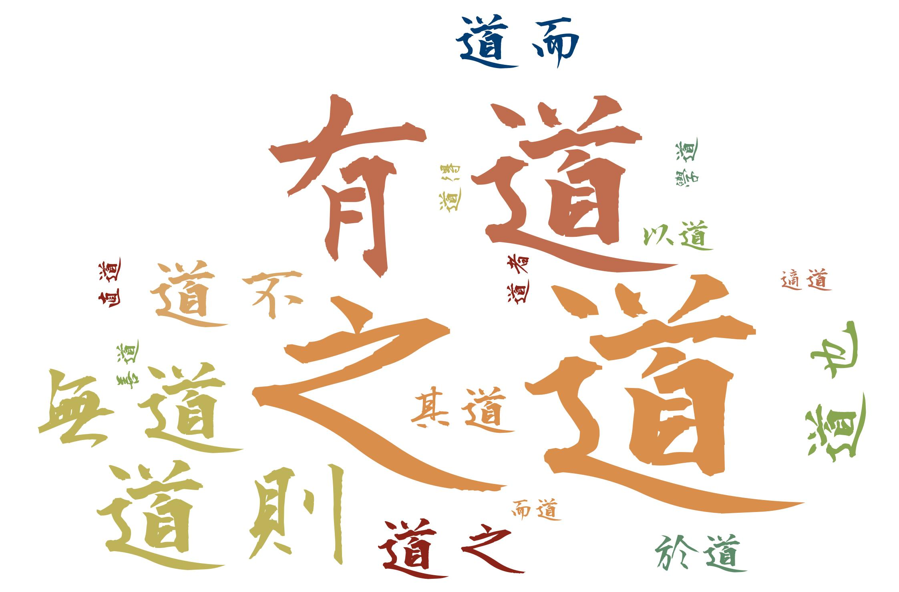

# Differences-Between-The-Uses-of-The-Character-in-Confucian-And-Daoist-Canon
This research studies the differences in the usage of the character "道" in these two different canons and, by extension, the two different schools of thought, from the perspectives of word frequency and its high-frequency collocations (nearby frequently co-occurring words).

## Project Overview

This research project investigates the differences in how the character "道" is used in two foundational Chinese philosophical texts: **The Analects of Confucius** (《论语》) and **Tao Te Ching** (《道德经》). Using corpus linguistics methods, this study examines both quantitative and qualitative aspects of the character's usage to reveal distinct philosophical emphases.

## Research Questions

- **RQ1**: How does the relative frequency of the character "道" differ between the two canons?
- **RQ2**: How do the most frequent clusters of "道" reveal its distinct semantic and philosophical roles in each canon?

## Methodology

This study employs a **corpus linguistics approach** with the following analytical methods:

- **Word Frequency Analysis**: Measures absolute and relative prominence of "道"
- **Cluster Analysis**: Identifies frequent word pairs containing "道" to reveal conceptual networks
- **Key Word in Context (KWIC)**: Examines specific usage in sentences for qualitative insights

## Tools Used

- **AntConc**: Primary corpus analysis tool for frequency lists, cluster tables, and KWIC analysis
- **Python**: Used for initial data processing and file preparation

## Key Findings

### Finding #1: Differential Prominence of "道"

#### Tao Te Ching: 76 occurrences in 5,281 tokens (≈1.44% of text)
#### The Analects of Confucius: 89 occurrences in 15,931 tokens (≈0.56% of text)

  
  
<em>Frequency of 道 in Tao Te Ching</em>

  
  
<em>Frequency of 道 in The Analects of Confucius</em>

**Conclusion**: "道" appears over 2.5 times more frequently relative to text length in the Tao Te Ching, indicating its central conceptual importance in Daoist thought.

### Finding #2: Distinct Semantic Profiles

#### Tao Te Ching's "道": Cosmological and Generative Force
- **Clusters**: 大道, 道生, 天道
- **Nature**: Fundamental, generative principle of the universe
- **Role**: Often appears as the subject of descriptive or active sentences
- **Example**: "道生一，一生二，二生三，三生萬物" (Ch. 42) - Dao as origin of all existence

#### Analects' "道": Socio-Ethical and Political Path
- **Clusters**: 有道/無道, 道之, 道也
- **Nature**: Moral standard for human conduct and governance
- **Role**: Often appears as the object of action or discussion
- **Example**: "天下有道則見，無道則隱" (8.13) - Dao as condition determining action

  
  
<em>The Frequent Clusters in Tao Te Ching</em>

  
  
<em>The Frequent Clusters in The Analects of Confucius</em>

**Conclusion**: In the Tao Te Ching, “道” is a cosmological and generative force. Clusters like 大道, 道生, and 天道 portray it as the impersonal, creative source of the universe—a metaphysical reality to be described and understood. In The Analects, “道” is a socio-ethical and political path. Clusters like 有道/無道 and 道之 frame it as a tangible standard for human conduct and governance—a moral ideal that can be followed, possessed, lost, or applied.

## Conclusion

The analysis reveals fundamentally different conceptions of "道":

- In **Tao Te Ching**, "道" represents a **cosmological and generative force** - the impersonal, creative source of the universe
- In **The Analects**, "道" represents a **socio-ethical and political path** - a tangible standard for human conduct and governance

These differences reflect the distinct philosophical orientations of Daoism (metaphysical and cosmological) and Confucianism (ethical and political).
